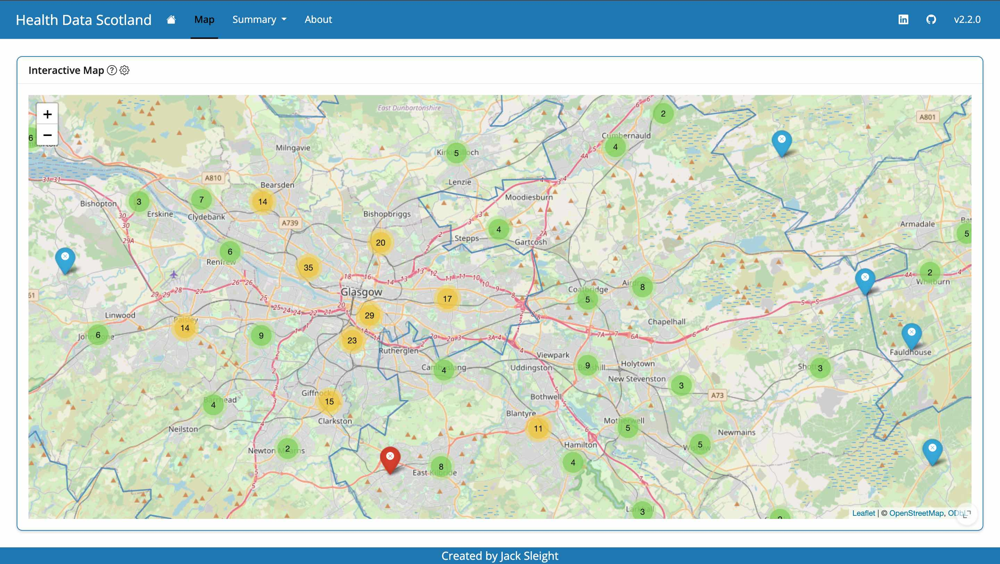
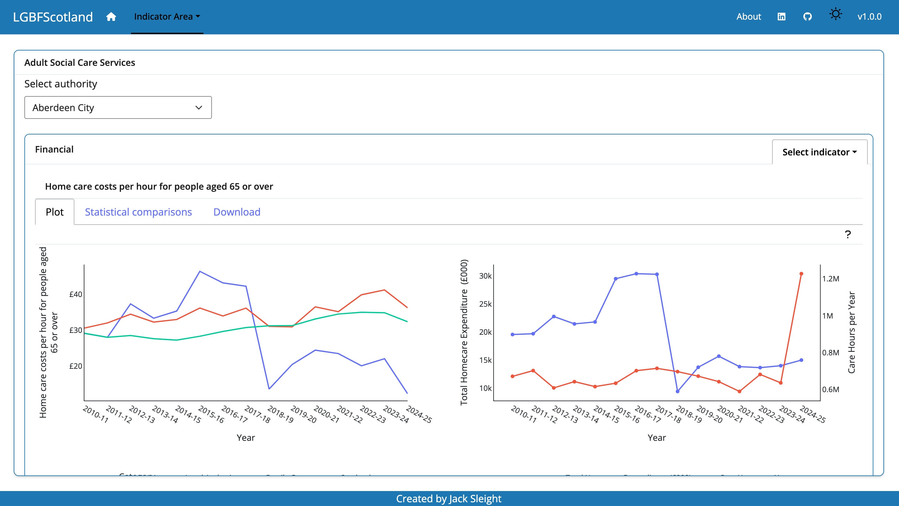
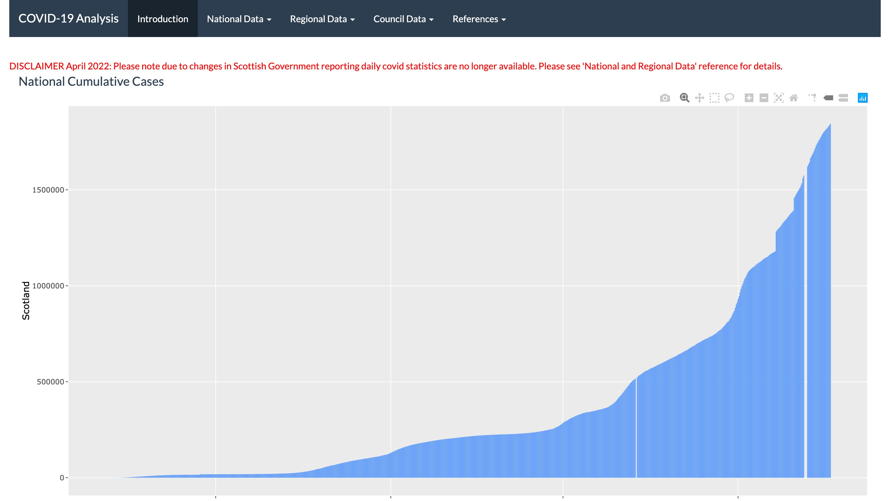

## [HealthDataScotland](https://www.healthdatascotland.co.uk/)

**Motivation**

The idea of `HealthDataScotland` arose when I found myself moving address and
trying to find GP practices in my local area. My first thought was to create an
interactive dashboard that allowed users to view GP practices in their local
area and obtain their contact details. However, this idea expanded to make an
more generic application that presented locations of different types of health
care centre. I underwent a process of trying to identify which public data sets
containing this data were available and then trying to design an object-oriented
R package that was able to handle different health care centres and present
their data in an appropriate manner.

**Output**

`HealthDataScotland` is an R package that contains functionality to extract,
transform and load GP practice and hospital data from across Scotland, and
present this as an interactive R shiny application.

The shiny application is hosted using the Azure container app service with a
custom domain name. The data underlying the application is stored using the
Azure blob service and the ETL process is performed periodically using a
custom GitHub action.

I have tried to design the underlying R package to be generic so that it can be
easily extended to present different health care centres when appropriate public
sets become available. Currently `HealthDataScotland` only presents GP practices
and hospitals. However, in future versions the app may be able to present data
for other health care settings such as dental practices or pharmacies.

For more details please refer to the
[documentation](https://jsleight1.github.io/HealthDataScotland/).

**Please note the container is not always running and may take a few moments to
load**

## [LGBFScotland](https://www.lgbfscotland.co.uk/)

**Motivation**

The local government benchmarking framework
([LGBF](https://www.improvementservice.org.uk/products-and-services/data-intelligence-and-benchmarking/local-government-benchmarking-framework))
combines different metrics that allow assessment of how well local authorities
in Scotland are delivering their services. I had previously completed an R
project analysing this data set (see [LGBF](https://github.com/jsleight1/LGBF)).
However a key motivation for this new project was that I wanted to improve my
skills in developing packages with Python. The LGBF is publicly available and
provides some interesting insights into the performance of Scottish local
authorities. Therefore, I thought this would be a good data set to gain
experience using [Shiny for Python](https://shiny.posit.co/py/) and developing
python packages using the [uv](https://docs.astral.sh/uv/) Python package
manager.

**Output**

`LGBFScotland` is a Python package containing functionality to extract,
transform and load LGBF data, and present this as an interactive Python shiny
application.

The shiny application is hosted using the Azure container app service with a
custom domain name. The data underlying the application is stored using the
Azure blob service and the ETL process is performed periodically using a
GitHub action.

**Please note the container is not always running and may take a few moments to
load**

## [COVID-19 Scotland](https://jack-sleight.shinyapps.io/covid_shiny/)

**Motivation**

In 2020 the UK had been placed into lockdown due to the ongoing COVID-19
pandemic. Like most people I suddenly had some free time of my hands and wanted
to try and do something productive. I was relatively new to coding in R and had
never made an R shiny application before. I knew that the Scottish COVID-19
statistics were released publicly on a daily basis and I thought it would be a
good idea to try and make an R Shiny application that used these data sets.

**Output**

`covid19_scotland` is an R shiny application containing functionality to perform
an ETL process of COVID-19 pandemic statistics from across Scotland, and present
this as an interactive R shiny application.

The shiny application is hosted on `shinyapps.io` with the data being stored
using Dropbox. During the pandemic the ETL process was performed periodically
using a local CRON job.

This application was my first ever public data application and provided me with
a good understanding as to how publicly available data can be visualised using
tools such as R Shiny.

This application was deprecated in 2022.
